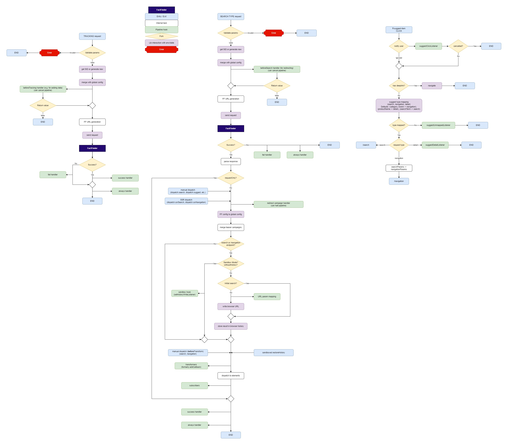

FactFinder Web Components
==========================

See [web-components.fact-finder.de](https://web-components.fact-finder.de/) for full documentation.


## Installation

### Option 1 (Using npm)

1. Install [Node.js](https://nodejs.org/en/)
2. Type `npm init` and follow the instructions
3. Add the following line to the `dependencies` section in `package.json`:  
   ```json
   "ff-web-components": "https://github.com/FACT-Finder-Web-Components/ff-web-components.git#5.x.x"
   ```
   Adjust the version as necessary.
4. Run `npm install`


### Option 2 (Manual download)

1. Download a version directly from [GitHub](https://github.com/FACT-Finder-Web-Components/ff-web-components/releases) or download it via [web-components.fact-finder.de](https://web-components.fact-finder.de/download)
2. Unzip the file
3. Save the contents to your location of choice


# Migration Guide (migrating from `4.x`)

This guide documents the changes to the Web Components library since version `4.x`.

It is not a step-by-step guide to walk you through the migration.
Skim through the document in its entirety first to get an overview of all changes before starting to work through each topic in detail.


## Overview

Web Components has undergone a complete rewrite of its core.
The new library more closely reflects the FactFinder REST API with as few abstractions as possible.
This shall reduce the number of concepts required to learn while simultaneously increase transparency of the data flow.

The data models the library uses are identical, with very few exceptions, to the models used by the FactFinder API.
You can (and should) always consult FactFinder's API documentation for details.


### Backward compatibility

FactFinder versions prior to NG (`v5` API) are no longer supported.
Going forward, the latest version of Web Components will only support the latest API version of FactFinder.


### Diagram of request/response pipelines

There is now more focus on the request/response pipelines which shall provide more clarity of the data flow.
See the end of this migration guide for a visual representation of these pipelines.


## Including the library

The way the library is referenced from your project has not changed.


## Getting access to the Core

The concept of accessing the core has not changed compared to previous versions.
The `ffReady` event is now called `ffCoreReady`.
This shall emphasize that the core and the custom elements initialize separately.

```js
document.addEventListener(`ffCoreReady`, ({ factfinder, init, initialSearch }) => {

});
```

`ffCoreReady` fires exactly once as soon as the core finishes initializing.
The event object in the event listener receives three fields.

`factfinder` is the reference to the core.
After initialization, `factfinder` is also globally available.

```js
window.factfinder
```

`init` is the function with which you initialize the Web Components application.
**It must be called exactly once during the `ffCoreReady` event.**
Failing to do so results in the Web Components library to throw an exception.

See the _Initialization of the Web Components application_ section for details on usage and available options.

`initialSearch` is a function that replaces the `search-immediate` concept from previous versions.
It takes a search or navigation _params_ object as its first argument and optionally a search or navigation _options_ object as its second.
Depending on whether the application is configured to be a category page or regular search page, the function will invoke either a `search` or `navigation` request from the `factfinder.request` namespace.

Make sure to always use this function for the initial search request as it provides different handling of the browser history than a regular search request.

```js
initialSearch({ query: `deck chair` }, { userId: `user123` });
```

You can always pass a _SearchParams_ object to `initialSearch`, even when the application is configured to category page.
In this case, `initialSearch` will internally convert the _SearchParams_ to _NavigationParams_.
See your FactFinder API documentation for details.


## Core API

The core's structure is as follows.

```js
factfinder: {
    request: {
        campaignPage: (Required CampaignPageParams, Optional RequestOptions) => Promise CampaignsResult,
        campaignProduct: (Required CampaignProductParams, Optional RequestOptions) => Promise CampaignsResult,
        campaignShoppingCart: (Required CampaignShoppingCartParams, Optional RequestOptions) => Promise CampaignsResult,
        navigation: (Required NavigationParams, Optional NavigationOptions) => Promise Result,
        navigationCategory: (Required NavigationCategoryParams, Optional RequestOptions) => Promise CategoryNavigation,
        predictiveBasket: Required PredictiveBasketParams, Optional RequestOptions) => Promise PredictiveBasketResult,
        recommendation: (Required RecommendationParams, Optional RequestOptions) => Promise RecommendationResultWithFieldRoles,
        records: (Required RecordsParams, Optional RequestOptions) => Promise FlatRecordsResult,
        search: (Required SearchParams, Optional SearchOptions) => Promise Result,
        similar: (Required SimilarParams, Optional RequestOptions) => Promise SimilarProductsWithFieldRoles,
        suggest: (Required SuggestParams, Optional RequestOptions) => Promise SuggestionResult,
        before: {
            campaignPage: CancellableSubscriber RequestInfoCampaignPage => SubscriberID,
            campaignProduct: CancellableSubscriber RequestInfoCampaignProduct => SubscriberID,
            campaignShoppingCart: CancellableSubscriber RequestInfoCampaignShoppingCart => SubscriberID,
            compare: CancellableSubscriber RequestInfoCompare => SubscriberID,
            navigation: CancellableSubscriber RequestInfoNavigation => SubscriberID,
            navigationCategory: CancellableSubscriber RequestInfoNavigationCategory => SubscriberID,
            predictiveBasket: CancellableSubscriber RequestInfoPredictiveBasket => SubscriberID,
            recommendation: CancellableSubscriber RequestInfoRecommendation => SubscriberID,
            records: CancellableSubscriber RequestInfoRecords => SubscriberID,
            search: CancellableSubscriber RequestInfoSearch => SubscriberID,
            similar: CancellableSubscriber RequestInfoSimilar => SubscriberID,
            suggest: CancellableSubscriber RequestInfoSuggest => SubscriberID,
        },
    },
    response: {
        subscribeCampaignPage: Subscriber CampaignsResult => SubscriberID,
        subscribeCampaignProduct: Subscriber CampaignsResult => SubscriberID,
        subscribeCampaignRedirect: CancellableSubscriber ({ campaign: Campaign, result: Result }) => SubscriberID,
        subscribeCampaignShoppingCart: Subscriber CampaignsResult => SubscriberID,
        subscribeNavigation: Subscriber Result => SubscriberID,
        subscribeNavigationCategory: Subscriber CategoryNavigation => SubscriberID,
        subscribePredictiveBasket: Subscriber PredictiveBasketResult => SubscriberID,
        subscribeRecommendation: Subscriber RecommendationResultWithFieldRoles => SubscriberID,
        subscribeRecords: Subscriber FlatRecordsResult => SubscriberID,
        subscribeSearch: Subscriber Result => SubscriberID,
        subscribeSimilar: Subscriber SimilarProductsWithFieldRoles => SubscriberID,
        subscribeSuggest: Subscriber SuggestionResult => SubscriberID,
        subscribeSearchAndNavigation: Subscriber Result => SubscriberID,
        unsubscribe: SubscriberID => Boolean,
        transformCampaignPage: Transformer CampaignsResult => undefined,
        transformCampaignProduct: Transformer CampaignsResult => undefined,
        transformCampaignShoppingCart: Transformer CampaignsResult => undefined,
        transformCompare: Transformer CompareResult => undefined,
        transformNavigation: Transformer Result => undefined,
        transformNavigationCategory: Transformer CategoryNavigation => undefined,
        transformPredictiveBasket: Transformer PredictiveBasketResult => undefined,
        transformRecommendation: Transformer RecommendationResultWithFieldRoles => undefined,
        transformRecords: Transformer FlatRecordsResult => undefined,
        transformSearch: Transformer Result => undefined,
        transformSimilar: Transformer SimilarProductsWithFieldRoles => undefined,
        transformSuggest: Transformer SuggestionResult => undefined,
        dispatch: {
            navigation: (Result, Optional RequestInfoNavigation) => Result,
            navigationBeforeTransform: (Result, Optional RequestInfoNavigation) => Result,
            search: (Result, Optional RequestInfoSearch) => Result,
            searchBeforeTransform: (Result, Optional RequestInfoSearch) => Result,
            suggest: (SuggestionResult, Optional RequestInfoSuggest) => SuggestionResult,
            ssrNavigation: (Result, Optional RequestInfoNavigation) => Result,
            ssrSearch: (Result, Optional RequestInfoSearch) => Result,
        },
    },
    tracking: {
        cart: (Required (NonEmptyArray CartOrCheckoutEvent), Optional RequestOptions) => Promise undefined,
        checkout: (Required (NonEmptyArray CartOrCheckoutEvent), Optional RequestOptions) => Promise undefined,
        click: (Required (NonEmptyArray ClickEvent), Optional RequestOptions) => Promise undefined,
        landingPageClick: (Required (NonEmptyArray LandingPageClickEvent), Optional RequestOptions) => Promise undefined,
        login: (Required (NonEmptyArray LoginEvent), Optional RequestOptions) => Promise undefined,
        predbasketClick: (Required (NonEmptyArray PredBasketClickEvent), Optional RequestOptions) => Promise undefined,
        recommendationClick: (Required (NonEmptyArray RecommendationClickEvent), Optional RequestOptions) => Promise undefined,
        before: {
            cart: CancellableSubscriber RequestInfoTrackCartOrCheckout => SubscriberID,
            checkout: CancellableSubscriber RequestInfoTrackCartOrCheckout => SubscriberID,
            click: CancellableSubscriber RequestInfoTrackClick => SubscriberID,
            landingPageClick: CancellableSubscriber RequestInfoTrackLandingPageClick => SubscriberID,
            login: CancellableSubscriber RequestInfoTrackLogin => SubscriberID,
            predbasketClick: CancellableSubscriber RequestInfoTrackPredBasketClick => SubscriberID,
            recommendationClick: CancellableSubscriber RequestInfoTrackRecommendationClick => SubscriberID,
         },
    },
    config: {
        get: () => Config
        setFFParams: ffParams => undefined,
        setAppConfig: appConfig => undefined,
    },
    notifications: {
        addSuggestClickListener: CancellableSubscriber Origin => undefined,
        setSuggestDetailListener: Subscriber Origin => undefined,
        setSuggestUnmappedListener: Subscriber Origin => undefined,
    },
    routing: {
        setNavigateListener: ((url, origin) => Boolean) => undefined,
        setUrlParamOptionsListener: (() => UrlParamMappingOptions) => undefined,
        sandboxed: {
            restoreHistory: historyPayload => undefined,
            setHistoryWriteListener: (historyPayload => undefined) => undefined,
            setSessionReadWriteListeners: ({ read, write }) => undefined,
        },
    },
    utils: {
        env: {
            searchParamsFromUrl: options => SearchParams,
        },
        filterBuilders: {
            categoryFilter: (name, path) => Filter,
            filter: (name, values) => Filter,
        },
        formatters: {
            add: (name, fn) => undefined,
        },
    },
    version: String,
}
```


### Request

Methods in this namespace reflect the relevant FactFinder REST API endpoints.
They are used for initiating requests to FactFinder.
This replaces `EventAggregator.addFFEvent(ffEvent)`.

These methods take a required parameter which is equivalent to the FactFinder API specification for POST requests and an optional parameter to define various options to the request pipeline's behaviour.

All methods in this namespace return a `Promise` that resolves to the relevant result after the request/response pipeline has completed.
Note that this `Promise` rejects on server responses that are not `200`.
This is different from the `Promise` returned by the platform-native `fetch`.


#### 'before' pipeline hooks

Subscribers to these hooks are called before the related request is issued to FactFinder.
This can be useful for adding additional data to the request.

Subscribers in this namespace are of type `CancellableSubscriber`.
They receive one argument of the type mentioned above.
It is an object composed of the information received when the request was invoked.
These are the request parameters (e.g. `SearchParams`) and the request options, both supplemented with global default values when applicable.

When the `CancellableSubscriber` returns `false`, the request pipeline halts and no request is emitted.
This is useful when setting up **page redirects** as the result of the FactFinder request from the redirecting page is discarded anyway.
It is also useful if you need to interrupt the automatic pipeline processing and resume manually later.


### Response

Methods in this namespace are used to deal with the response part of the pipeline after the request returns from FactFinder.


#### Subscribers

`subscribe*` methods (e.g. `subscribeSearch` or `subscribeSuggest`) take a subscriber function and return the subscriber's auto-generated ID.
They replace `ResultDispatcher.subscribe(topic, fn)`.

Subscriber functions, when invoked by the response pipeline, receive two parameters.
- The first is the FactFinder result data of the type specified above.
- The second is a _RequestInfo_ object.

```js
factfinder.response.subscribeSuggest((suggestionResult, requestInfo) => {
  // suggestionResult: is `SuggestionResult` from the FactFinder REST API

  // requestInfo: contains the endpoint-specific params object
  // and the `requestOptions` object that were used to invoke the request.
  // {
  //   suggestParams,  // This would be `campaignPageParams`, `recommendationParams`, etc. for other endopints.
  //   requestOptions,
  // }
});
```

There are some special cases.
The _RequestInfo_ object for subscribers to `/search` or `/navigation` consists of the REST API's `SearchRequest` object, or `NavigationRequest` respectively, minus its `params` field but instead with a `requestOptions` field like in subscribers to other endpoints.

```js
factfinder.response.subscribeSearch((result, requestInfoSearch) => {
  // result: is `Result` from the FactFinder REST API

  // requestInfoSearch:
  // {
  //   searchParams,
  //   searchOptions: {
  //     searchControlParams,
  //     sid,
  //     userId,
  //     userInput,
  //
  //     requestOptions,
  //   },
  // }
});
```

Another special case is the `factfinder.response.subscribeSearchAndNavigation` subscription.
Depending on whether the `/search` or the `/navigation` endpoint was queried, the second argument to the subscriber is either `searchOptions` or `navigationOptions`.

Lastly, `factfinder.response.subscribeCampaignRedirect` also receives different arguments.

> Pro tip!
>
> Remember, you can always inspect the arguments to subscribers by logging them to the browser's console and by setting a breakpoint.

```js
factfinder.response.subscribeSearchAndNavigation((...args) => {
  console.log(...args);
  debugger;
});
```

Return values of subscribers are discarded.

Subscribers receive data **after** the Web Components.

You can subscribe as many handlers as you like.
Subscribers are called in the order they were registered.

`unsubscribe` lets you remove a subscriber by passing its subscriber ID that you received when registering it.


#### Transformers

Transformers are used to manipulate a FactFinder result **before** it is dispatched to the Web Components.
They take one parameter of the type specified above.
They replace `ResultDispatcher.addCallback(topic, fn)`.

Transformers must return the manipulated result, or an error will be emitted.

You can register as many transformers as you like.
They are called in the order of registration.


#### Dispatching manually

You can manually invoke the response pipeline by sending data through the various entry points in the `response.dispatch` namespace.
It replaces the `ResultDispatcher.dispatchXYZ` family.

Methods in this namespace take the data to be dispatched and an optional `RequestInfo` object.
This object would usually be produced on the request side of the pipeline.
Provide it if there is information necessary to the steps in the response pipeline.

Data dispatched this way goes through the same process as data that is coming directly from FactFinder.
All eligible subscribers will be invoked.
The Web Components application does not distinguish between manually and automatically dispatched responses.

The `response.dispatch.search` method, for example, invokes the response pipeline to the `/search` API endpoint.

For _Server Side Rendering_, use `response.dispatch.ssrSearch` for dispatching your SSR result on search result pages and `response.dispatch.ssrNavigation` on category pages.
These two functions will cause DOM elements to receive their relevant data whenever they connect to the DOM without having to consider rendering delays.


### Tracking

Methods in the `tracking` namespace communicate with their respective API endpoint.
They take an array of tracking events and a request options object.
The array must have at least one element or an error will be thrown.

The tracking methods return a `Promise` that resolves when the request completes.
There is no response data and no response pipeline will be triggered.
These methods are request-only.


#### 'before' pipeline hooks

This namespace offers methods to subscribe to the tracking request pipeline.
The mechanics are the same as those in the `request.before` namespace.

Registered subscribers receive a request info object with two properties.
- `events` - an array of the tracking event objects that were passed to the related tracking function
- `requestOptions` - an object with options to control the request pipeline (same as in `request.before` namespace)


### Config

You can update parts of the application's configuration at runtime with the functions in this namespace.
The objects to pass have the same structure as the relevant counterparts on the config object during the application's initialization.

For details on the parameters' purposes, see the _Initialization of the Web Components application_ section.

`get` takes no argument and returns a copy of the application's configuration.
The returned object has the same structure as the one you pass to `init` during initialization.

```js
factfinder.config.get()
```

`setFFParams` updates the library's configuration with parameters that are relevant to multiple FactFinder API endpoints.
These parameters will appear in all requests to the FactFinder API that accept them.
The function takes an object with the following fields:

```js
// All fields are optional.
factfinder.config.setFFParams({
    purchaserId,  // String
    sid,          // String
    userId,       // String
});
```

`setAppConfig` updates the library's configuration with parameters that are exclusively relevant to how the client-side application behaves.
It takes an object with the following fields:

```js
// All fields are optional.
factfinder.config.setAppConfig({
    autoFetch,        // String enum
    categoryPage,     // Array of _Filter_ objects as defined by the FF API
    dataBindingTags,  // Array of String
    debug,            // Boolean
    fieldRoles,       // Object
    formatting: {
        locale,         // String
        formatOptions,  // Same as `options` object in platform-native `Intl.NumberFormat(locales, options)`.
    },
    sandboxMode,      // Boolean
});
```


### Notifications

Web Components no longer emits DOM events (e.g., `suggest-item-clicked`).
Instead, the global `factfinder` object offers the `notifications` namespace.
There you can register event listeners independent of the current DOM status.

All suggest-related listeners receive a reference to the clicked `ff-suggest-item` through their `origin` parameter.

Multiple click-listeners can be added.

```js
factfinder.notifications.addSuggestClickListener(origin => {
    // Return `false` to prevent the pending request from being sent.
    // Returning `false` does NOT prevent other click listeners from being invoked.

    // return false;
});
```

The detail-listener is invoked when a suggest-item with a type specified in `ff-suggest`'s `request-mapping-detail` attribute is clicked.

```js
factfinder.notifications.setSuggestDetailListener(origin => {

});
```

The unmapped-listener is invoked when a suggest-item is clicked whose type does not appear in any of `ff-suggest`'s `request-mapping` attributes.

```js
factfinder.notifications.setSuggestUnmappedListener(origin => {

});
```


### Routing

The `routing` namespace has been introduced to the global `factfinder` object.
It contains various tools to deal with routing related topics.
It also contains a sub-namespace `routing.sandboxed` that, when you run Web Components in sandbox mode, enables you to manually deal with all environment interactions that Web Components would usually do automatically.

`setNavigateListener` allows you to register a listener that is invoked whenever Web Components arrives at a point where it would navigate to a new page.
For example after clicking on a product suggestion that leads to a product detail page.

You can interrupt Web Components' attempt to navigate and handle it as your environment requires.

```js
factfinder.routing.setNavigateListener((url, origin) => {
    // `url` is the URL to which Web Components is about to navigate to.
    window.location.href = `/my/custom/target`;
    return false;  // To prevent navigation by Web Components.
});
```

`setUrlParamOptionsListener` lets you register a handler that provides options to Web Components for translating _SearchParams_ to a URL string.
The handler is called before Web Components updates the URL and writes to the browser history.
It receives no arguments.

An example with the available options and their default values:

```js
factfinder.routing.setUrlParamOptionsListener(() => ({
    allow: [],
    block: [`activeAbTests`, `followSearch`, `purchaserId`],
    blockFilters: [],
    keyMapping: {},
    order: [`query`, `filters`, `sortItems`],
    postStringifier: undefined,
    stringifiers: {},
}));
```

See _Customize URL parameters_ for more details.


#### Sandbox mode

The functions in the `routing.sandboxed` namespace are only relevant when the Web Components application is configured to run in sandbox mode.
A typical use case is in single-page-applications.

> Caution
>
> Sandbox mode is a very advanced feature for very specific use cases that requires substantial knowledge about web app development, routing and state persistence.
> If you are not comfortable in these fields, we strongly advise against the use of sandbox mode.

`restoreHistory(historyPayload)` restores a search or navigation result.

Outside of sandbox mode Web Components would read the result data from the browser history after the `popstate` event.
By calling this function, you are calling Web Components' internal popstate handler.
Therefore, it is best to link this function to your integration's popstate handler or its equivalent.

As its argument `restoreHistory` takes an object (`historyPayload`) which has two fields:
- `result`
  - The _Result_ object as received from FactFinder that shall be restored.
- `requestInfo`
  - Either a `RequestInfoSearch` or a `RequestInfoNavigation` object depending on whether the result to be restored is a search or a navigation result.

> Note
>
> It is not necessary to build the `historyPayload` object yourself.
> You receive it from Web Components whenever it would usually create a browser history entry.
> Your integration merely has to keep track of these entries and pass them back to Web Components when required.

`setHistoryWriteListener(historyPayload => {})` lets you register a handler that is invoked when the response pipeline reaches the point where it would normally write to the URL and browser history.

It is also invoked when a request to FactFinder was issued with the `withoutHistory: true` option.
Set this parameter whenever you want to issue a search request without manipulating the browser history but when you still want to have the result dispatched to the custom elements.
The `withoutHistory` parameter is only available to **search** and **navigation** requests.

The handler receives a `historyPayload` object which is the same that you would pass to `restoreHistory(historyPayload)`.

```js
factfinder.request.search({ query: `tea and crumpets` }, { withoutHistory: true });

factfinder.routing.sandboxed.setHistoryWriteListener(historyPayload => {
  const { result, requestInfo } = historyPayload;

  // Handle history and URL manually.
});
```

`setSessionReadWriteListeners({ read, write })` lets you register read and write handlers to deal with session management.
In order to maintain a user session across page navigation Web Components usually uses `localStorage`.
In sandbox mode it is your responsibility to manage session data.

To register the listeners you pass an object with two fields (`read` and `write`) to `setSessionReadWriteListeners`.

The `read` listener is invoked whenever Web Components requires session data.
It receives no arguments.
Make the listener **return** the data that you received from the `write` listener.
If invalid data is returned, Web Components will generate a new session.
This automatically covers the case of a user visiting your page for the first time and thus being unable to provide valid session data.

The `write` listener is invoked whenever Web Components wants to persist updated session data.
It receives the session as its first argument.
Store it wherever appropriate for your integration.

Both `read` and `write` listeners will be called during each request to FactFinder.
There is no need to keep a history of session data.
Only the latest data is required.

Also make sure to not modify the session data.


##### Example

The following is a schematic example that outlines the concepts of the Web Components sandbox mode API.
Your actual integration is likely going to look tremendously different.

```js
document.addEventListener(`ffCoreReady`, ({ factfinder, init }) => {
    init({
        ff: {},  // Section omitted for brevity.

        appConfig: {
            sandboxMode: true,
        },
    });

    factfinder.routing.sandboxed.setSessionReadWriteListeners({
        read: () => yourApp.getSessionData(),
        write: sessionData => yourApp.storeSessionData(sessionData),
    });

    factfinder.routing.sandboxed.setHistoryWriteListener(historyPayload => {
        yourApp.storeHistoryData(historyPayload);
    });

    yourApp.router.onPopstateEvent(() => {
        factfinder.routing.sandboxed.restoreHistory(yourApp.getHistoryData());
    });
});
```


### Notes regarding the Core API

#### `requestOptions.origin`

Throughout the request/response pipeline you will encounter the `origin` reference in `requestOptions`.
It does not have a specific type as it can be anything.

If you issue a request manually, you have the option to set `origin` to whatever makes most sense for you.

If a request is issued by a Web Components element, `origin` will be the `ff-` DOM element that was interacted with.
You can access `origin` in for example the listeners from the `factfinder.request.before` namespace.

Be aware that the DOM element referenced in `origin` may be reused by the rendering mechanism when the upcoming response is processed.
Avoid storing and using the `origin` reference outside the context you encounter it.

Web Components restores previous search results from the browser history when navigating back and forth.
However, it is important to note that DOM elements cannot be stored in the browser history.
Therefore, restored search results that pass through the response pipeline do not contain the `origin` field.


#### Global values

`factfinder.communication.globalElementValues.currentFFSearchBoxValue` was removed without replacement.


## Initialization of the Web Components application

The initialization of the Web Components application happens during the `ffCoreReady` event.
The event occurs on the `document` object when the library's core finishes its initialization.

Call the `init` function and pass it a **config object** with all parameters your application requires.

The following example shows the **minimum setup**.

```js
document.addEventListener(`ffCoreReady`, ({ factfinder, init, initialSearch }) => {
    init({
        ff: {
            url: `https://your-instance.fact-finder.com/fact-finder`,
            channel: `your-channel`,
            apiKey: `your.apiKey`,
        },
    });
});
```

The config object is divided into three sections: `ff`, `ffParams`, and `appConfig`.


### `ff` - The essentials

This section must always be specified.
It is essential to establish a connection to the FactFinder API.

It has three required fields.

```js
ff: {
    url: `https://your-instance.fact-finder.com/fact-finder`,
    channel: `your-channel`,
    apiKey: `your.apiKey`,
}
```


#### API Key / Authentication

Web Components no longer automatically authenticates with the FactFinder API.
You have to create an API key first, then pass it to your Web Components application.
Refer to your FactFinder documentation for details on how to generate API keys.


### `ffParams` - Parameters for FactFinder requests

The `ffParams` section defines parameters that are relevant to various endpoints of the FactFinder REST API.
Once they are specified here, they will be added to all request types that accept them.

The `ffParams` section itself as well as each of its fields are optional.

```js
document.addEventListener(`ffCoreReady`, ({ factfinder, init, initialSearch }) => {
    init({
        ff: { ... },  // Section omitted for brevity.

        ffParams: {
            purchaserId: `optional string`,
            sid: `optional string`,
            userId: `optional string`
        },
    });
});
```


#### Session ID

If `sid` is empty and Web Components is unable to determine a session ID from the environment, a new random session ID will be generated and preserved across page loads.
Usually, you never have to set it.
You only need to set it if you want to force a particular session ID.


### `appConfig` - Application behavior

The `appConfig` section defines parameters that control how the client-side Web Components application behaves.
None of these parameters are sent to FactFinder.

The `appConfig` section itself and all of its fields are optional.
You only need to specify the fields you want to set.

The following example shows all available fields and their default values.

```js
document.addEventListener(`ffCoreReady`, ({ factfinder, init, initialSearch }) => {
    init({
        ff: { ... },  // Section omitted for brevity.

        appConfig: {
            autoFetch: `SSR_ONLY`,       // Enum. Other allowed values:  "ALWAYS_ON", "ALWAYS_OFF"
            categoryPage: undefined,     // Array of Filter
            dataBindingTags: undefined,  // Two-element array of String
            debug: false,                // Boolean
            fieldRoles: undefined,       // Object
            formatting: undefined,       // Object
            sandboxMode: false,          // Boolean
        },
    });
});
```


#### Auto fetching

The `autoFetch` parameter controls how Web Components elements behave when they are added to the DOM.
More generally, it affects all subscribers to the response pipeline.

When auto-fetching is active, subscribers to the response pipeline will be invoked immediately on registration and receive the last search result.

It takes one of three allowed values: `SSR_ONLY` (default), `ALWAYS_ON` and `ALWAYS_OFF`.

With `SSR_ONLY`, auto-fetching is not active from the beginning.
It becomes active when you use either `factfinder.response.dispatch.ssrSearch` or `factfinder.response.dispatch.ssrNavigation`.
Auto-fetching will remain active until a search or navigation request is triggered.
Use these when integrating _Server Side Rendering_.

`ALWAYS_ON` permanently sets auto-fetching to active while `ALWAYS_OFF` sets it inactive.


#### Category page

This property takes an array of `Filter` objects as defined by the FactFinder API.
When this property is set, Web Components considers the current page to be a category page and behaves accordingly.

Examples of this behavior are:
- usage of the `/navigation` API endpoint instead of `/search`
- specified category filters are fixed in the ASN and cannot be deselected
- click tracking events send the category path instead of the (non-existing) search query.

See the _Category Pages_ section for details on usage.


#### Data binding tags

The `dataBindingTags` property allows you to specify different tags for the HTML data bindings.
This may be necessary to avoid conflicts when you are using Web Components together with a third party rendering framework that uses the same data binding tags.
It is a **replacement** for the `mustache-delimiters` attribute on the discontinued `ff-communication` element.

Default tags:

```html
<ff-record>{{regular}}</ff-record>
<ff-record>{{{unescapedHtml}}}</ff-record>
```

Custom tags:

`dataBindingTags` takes an array of _two string elements_.
They must be different or the template engine will not be able to interpret the templates correctly.
Make sure to choose tags that do not occur anywhere else.

```js
init({
    appConfig: {
        dataBindingTags: [`[[`, `]]`],
    },
});
```
```html
<ff-record>[[regular]]</ff-record>
<ff-record>[[{unescapedHtml}]]</ff-record>
```

When using _unescaped HTML binding_, your template must use the custom tags plus a pair of **single** braces `{`,`}`.


#### Debug

A boolean value to define whether Web Components shall run in _debug_ or _live_ mode.

_Debug mode_ does not catch exceptions but instead lets them propagate as they occur.
After an error, the Web Components application will be in an invalid state.

There is also more logging.

It is advisable to use this mode during development to find errors quickly.

_Live mode_ is the default setting.
It will catch errors and skip to the next operation in order to keep the application running without becoming unusable.
Errors will be logged to the browser's console, so it is still possible to detect and locate errors.

Be aware that even in _live mode_ errors may cause data corruption that put the application into a nonsensical state.
The most important aim of _live mode_ is to prevent system level exceptions that halt the browser's whole execution process.


#### Field Roles

By setting this property you can tell the library the field role mapping without waiting for a response from FactFinder.
Here you can override the field roles defined in FactFinder.

If unset, the first response with field roles from FactFinder will set it.

While most scenarios don't require this value to be set, it is still advisable to always do so to avoid unexpectedly encountering situations that do require this value.

You do need to set it when you want to issue requests that rely on the field roles, but you don't want to first invoke a search request.
This is typically limited to checkout-tracking requests.


#### Localization / formatting

Currency formatting in the previous version of Web Components was done in a centralized fashion by configuring attributes such as `currency-country-code` or `currency-fields`.
When set, Web Components would modify relevant data in-place at the data layer.

The new approach works entirely at the display layer without modifying any data.
It uses the web platform's native localization API.
See [documentation at MDN](https://developer.mozilla.org/en-US/docs/Web/JavaScript/Reference/Global_Objects/Intl/NumberFormat).

You decide directly in the Web Components HTML templates which fields to format.
Web Components offers several default formatters for currency and generic decimal numbers, but you may also specify your own in case the default formatters don't satisfy your requirements.


##### Setup

First, you configure _locale_ and _formatting options_ in the `formatting` parameter.
This is an object with two properties `locale` and `formatOptions`.
These are the same values that you would pass to the platform-native `Intl.NumberFormat(locales, options)` constructor.
See [MDN for details](https://developer.mozilla.org/en-US/docs/Web/JavaScript/Reference/Global_Objects/Intl/NumberFormat/NumberFormat).

Example:

```js
init({
    appConfig: {
        formatting: {
            locale: `en-GB`,
            formatOptions: {
                style: `currency`,
                currency: `GBP`,
            },
        },
    },
});
```


##### Formatting

You format numbers directly in the HTML templates by adding the desired formatter to the data binding.
If a formatter is for example called `$`, this could look like this:

```html
<ff-record>{{$ variantValues.0.Price}}</ff-record>
```

Formatters are ordinary functions and may take multiple parameters or none at all.

```html
<ff-record>Price rounded to a whole number: {{$ variantValues.0.Price 0}}</ff-record>
```

Web Components offers the following **default formatters**:

- `$` (number, fractionDigits): Formats its first parameter according to the currency configuration.
  The second parameter is optional and allows you to override your global settings for the number of decimal places.
  ```html
  <ff-record>
    <span>{{$ variantValues.0.Old_price 0}}</span>
    <span>{{$ variantValues.0.Price}}</span>
  </ff-record>
  ```

- `$dec` (number, fractionDigits): Formats numbers according to your _locale_ settings without any units.
  The second parameter is optional.
  ```html
  <ff-record>Tolerance: {{$dec variantValues.0.Tolerance 3}} mm</ff-record>
  ```

- `$bctFilter`: This formatter takes no arguments and only works in `ff-breadcrumb-trail-item` elements with `type="filter"`.
  This specialized formatter is necessary because of the special data structure provided in the `ff-breadcrumb-trail-item` template context.

  **Important!**
  It formats only items that are related to facets with a `unit` set.
  You set this `unit` in your FactFinder UI, it must be identical to the currency unit that your formatting configuration produces.
  If your `formatOptions` are configured to render a `€` symbol, your `unit` settings in the FactFinder UI must also be `€` for this particular facet.
  ```html
  <ff-breadcrumb-trail-item type="filter">{{$bctFilter}}</ff-breadcrumb-trail-item>
  ```

- `$facetElement`: This formatter takes no arguments and only works in `ff-filter-cloud` and `ff-asn-group-element`.

  **Important!**
  Like `$bctFilter` it only formats values related to a facet with its `unit` set to the currency symbol that your `formatOptions` produce.

  ```html
  <ff-filter-cloud>
    <span data-template="filter">[x] {{facet.name}}: {{$facetElement}}</span>
  </ff-filter-cloud>

  <ff-asn>
    <ff-asn-group for-group="price">
      <ff-asn-group-element>
        <div slot="unselected">{{$facetElement}} ({{element.totalHits}})</div>
        <div slot="selected">{{$facetElement}}</div>
      </ff-asn-group-element>
    </ff-asn-group>
  </ff-asn>
  ```


##### Custom formatters

If the default formatters don't meet your requirements, you have the option to define your own formatters.
Use the `factfinder.utils.formatters.add(name, fn)` method to register them.
(Note that you cannot overwrite existing formatters.)

The function that you pass as the second argument receives all values that are passed to it from the HTML template.
The `this` keyword will be a reference of the data object available in the HTML template context.
(Use the `function` keyword instead of an arrow function if you want to use `this`.)

```js
factfinder.utils.formatters.add(`allCaps`, function(str) {
    return str.toUpperCase();
});
```

```html
<ff-record>{{allCaps variantValues.0.Title}}</ff-record>
```

In the HTML example above, `this` inside the `allCaps` function would point to the _Record_ object that you can also access from within `ff-record`.

As an **alternative to custom formatters**, you can also use the `factfinder.response.transform___` API to directly manipulate data fields and display them without any further formatting.


#### Sandbox mode

> Caution
>
> Sandbox mode is a very advanced feature for very specific use cases that requires substantial knowledge about web app development, routing and state persistence.
> If you are not comfortable in these fields, we strongly advise against the use of sandbox mode.

When `sandboxMode` is `true`, Web Components will not interact with the browser environment but instead invoke relevant listeners to notify you when Web Components _would_ have manipulated the environment.
From within these listeners you are free to invoke actions as your individual integration requires.

Sandbox mode is typically used in single-page-applications but may also provide the required flexibility whenever Web Components' history management conflicts with your integration.

Actions Web Components will **not** take when `sandboxMode` is `true` include
- navigate to another page
- read/write browser history
- read/write URL
- manipulate `localStorage`

DOM updates are not affected by sandbox mode.


## Custom Elements

### Data structure

In previous versions Web Components transformed the data it received from FactFinder into the data structure of FACT-Finder 7.3.
Starting from this version, this transformation no longer happens.
The response data as reported by the browser's network tab is now reflected in the Web Components' HTML templates.


### ff-communication

The `ff-communication` element is no longer available.
Instead, you configure your Web Components application with JavaScript.

Listen to the global `ffCoreReady` event and pass all relevant parameters to the `init` function.

```js
document.addEventListener(`ffCoreReady`, ({ factfinder, init, initialSearch }) => {
    init({
        ff: {
            url: `https://your-instance.fact-finder.com/fact-finder`,
            channel: `your-channel`,
            apiKey: `your.apiKey`,
        },
    });

    // This is also the best place to invoke a search request replacing the `search-immediate` attribute.
    initialSearch({ query: `deck chair` });
});
```


### ff-searchbox

#### Attributes

The `hide-suggest-onblur` attribute is no longer available.
It was replaced by the `hide-onblur` attribute on the `ff-suggest` element.

The default value of `suggest-delay` was changed from `0` to `350` ms.


### ff-searchbox and ff-searchbutton

#### Linking

`ff-searchbutton` relies on the current value in `ff-searchbox`.
A page may have multiple search boxes and search buttons where each button needs to know which search box's current value it shall use to generate a search request from.
As a consequence these two elements must now be linked explicitly.
There are two options to establish this link.


##### Nesting

By nesting the `ff-searchbutton` inside an `ff-searchbox`, the elements automatically detect their relation.

```html
<ff-searchbox>
    <input type="search">
    <ff-searchbutton><button>Search</button></ff-searchbutton>
</ff-searchbox>
```


##### Via attributes

Similar to the native HTML elements `label` and `input` you can define the `id` attribute on `ff-searchbox` and the `for` attribute on `ff-searchbutton` and give them the same value.
With this approach the elements' locations in the DOM are irrelevant.

```html
<div>
    <ff-searchbox id="ffSearchBox">
        <input type="search">
    </ff-searchbox>
</div>
<div>
    <ff-searchbutton for="ffSearchBox">
        <button>Search</button>
    </ff-searchbutton>
</div>
```


#### Events

`ff-searchbox` and `ff-searchbutton` no longer emit the `before-search` event.
Use the new `factfinder.request.before.search()` instead to subscribe to the request pipeline and, if required, interrupt it.


### ff-suggest

The default value of `hide-onblur` is now `true`.
The previous mechanism to close `ff-suggest` on command of `ff-searchbox` was removed.

Toggling through suggest-items with left/right arrow keys on the keyboard is no longer supported.
Up/down functionality remains unchanged.


#### New attribute `for-searchbox`

This attributes takes a comma-separated list of `ff-searchbox` ids from which `ff-suggest` shall receive data.

```html
<ff-searchbox id="box1"></ff-searchbox>
<ff-searchbox id="box2"></ff-searchbox>

<!-- Reacts to the `ff-searchbox` with id=box1 but not to the one with id="box2". -->
<ff-suggest for-searchbox="box1"></ff-suggest>
```

Make sure there is no additional white-space in the list.

```html
<!-- Would still only listen to the first search box because the second ID is parsed as " box2" (with a leading space).  -->
<ff-suggest for-searchbox="box1, box2"></ff-suggest>
```


### ASN

The `ff-asn` element has a new attribute `hide-facets`.
You can use it to prevent the ASN from rendering the specified facets without removing them from the response data.

A common use case is to hide the category facet on category pages or the brand facet on brand pages.

Previously, you had to use CSS, which would still have the `ff-asn` element process the data.
Or you had to delete the facet from the search result which could lead to data integrity problems.

The attribute takes a comma-separated list of facet names.
Note that these are **not** the facet's display name but the _field name_ from your data feed.
In the FactFinder response it is called the `associatedFieldName`.

```html
<ff-asn hide-facets="category,brand"></ff-asn>
```


### Slider

#### One Touch Slider element merged

The elements `ff-slider` and `ff-slider-one-touch` have been merged into `ff-slider`.
The `ff-slider-one-touch` element is no longer available as a stand-alone element.
Instead, you can toggle the "one-touch" behaviour on by setting the `one-touch` attribute on `ff-slider`.

Classic slider:

```html
<ff-slider></ff-slider>
```

One-Touch slider:

```html
<ff-slider one-touch></ff-slider>
```


#### Attributes

The `step-size` attribute on `ff-slider` was renamed to `step`.

```html
<!-- Previously -->
<ff-slider step-size="5"></ff-slider>

<!-- Now -->
<ff-slider step="5"></ff-slider>
```

The `unit` attribute on `ff-slider` is no longer required and was removed.


#### Slider Control

In `ff-slider-control`, the `input` elements were required to have an attribute `data-control="1"` and `data-control="2"` respectively to define which `input` controls the lower-value handle and which controls the upper-value handle.

The values to these attributes have been changed from `1` and `2` to `min` and `max`.

```html
<ff-slider-control>
  <div>
    <input data-control="min">
  </div>
  <div>
    <input data-control="max">
  </div>
</ff-slider-control>
```

The numbers rendered in the `input` elements are no longer formatted with a unit symbol.
They are formatted as a decimal number according to your `factfinder.config.get().appConfig.formatting.locale` settings.

The attribute `decimal-places` was **renamed** to `fraction-digits`.
It allows you to define the number of decimal places rendered in the `input` elements.
The **default value** changed from `undefined` to `0`.

In order to render the facet's unit there is a **new attribute** `data-unit` that can be put on any element.
The `innerText` of these elements gets overwritten with the `unit` that is defined for the related _Facet_ object.
Leave those elements empty.

```html
<ff-slider-control fraction-digits="2">
  <div>
    <input data-control="min">
    <span data-unit></span>
  </div>
  <div>
    <input data-control="max">
    <span data-unit></span>
  </div>
</ff-slider-control>
```

The **default template** of `ff-slider-control` no longer uses inline styles.
If you leave `ff-slider-control` empty, the following HTML is used:

```html
<div class="ffw-slider-control-default">
  <ff-slider one-touch></ff-slider>

  <div class="ffw-slider-control-inputs">
    <div class="ffw-input-container">
      <input data-control="min">
      <span data-unit></span>
    </div>

    <span class="ffw-slider-control-line"></span>

    <div class="ffw-input-container">
      <input data-control="max">
      <span data-unit></span>
    </div>
  </div>
</div>
```


### Breadcrumb Trail

The data format available in the HTML template context of `ff-breadcrumb-trail-item` has changed.

Previously, it was the _BreadCrumbTrailItem_ as defined by the FactFinder API.
Now it is an object with both the _BreadCrumbTrailItem_ and the related _Facet_ object.
For details on the structure of each of these objects, please see your FactFinder API documentation.

Note that the `facet` is only available in items with `type="filter"`.
In items with other types `facet` is `undefined`.

Before:

```html
<ff-breadcrumb-trail>
  <ff-breadcrumb-trail-item type="filter">{{text}}</ff-breadcrumb-trail-item>
</ff-breadcrumb-trail>
```

Now:

```html
<!-- Data structure
{
    facet: Facet,
    item: BreadCrumbTrailItem,
}
-->
<ff-breadcrumb-trail>
  <ff-breadcrumb-trail-item type="filter">{{facet.name}}: {{item.text}}</ff-breadcrumb-trail-item>
  <ff-breadcrumb-trail-item type="search">Facet is undefined: {{facet}}</ff-breadcrumb-trail-item>
</ff-breadcrumb-trail>
```


### Recommendations

Default values to `ff-recommendation` are now aligned with the FactFinder API.
The data format provided in HTML templates changed from `TypedFlatRecord` to `RecordWithId`.

```html
<ff-recommendation>
  <ff-record-list>
    <template data-role="record">
      <ff-record>
        <!-- `Title` and `Price` are example fields that may exist in a data feed. -->
        <div>{{variantValues.0.Title}}</div>
        <div>{{variantValues.0.Price}}</div>
      </ff-record>
    </template>
  </ff-record-list>
</ff-recommendation>
```


#### Attributes

`usePerso` was renamed to `usePersonalization` to match the parameter name in the FactFinder API.

`subscribe` was removed.
`ff-recommendation` receives data exclusively from requests issued by itself.
This also means that manually invoking a request via `request.recommendation()` through JavaScript will not populate any `ff-recommendation` elements.
You can still populate the nested `ff-record-list` manually.

`record-id` was renamed to `product-number`.
It takes the value that is labeled with the `productNumber` **field role**.


### Similar Products

Default values to `ff-similar-products` are now aligned with the FactFinder API.
The data format provided in HTML templates changed from `TypedFlatRecord` to `RecordWithId`.

```html
<ff-similar-products>
  <ff-record-list>
    <template data-role="record">
      <ff-record>
        <!-- `Title` and `Price` are example fields that may exist in a data feed. -->
        <div>{{variantValues.0.Title}}</div>
        <div>{{variantValues.0.Price}}</div>
      </ff-record>
    </template>
  </ff-record-list>
</ff-similar-products>
```

`ff-similar-products` receives data exclusively from requests issued by itself.
This also means that manually invoking a request via `request.similar()` through JavaScript will not populate any `ff-similar-products` elements.
You can still populate the nested `ff-record-list` manually.


#### Attributes

`record-id` was renamed to `product-id`.
Depending on `id-type`, it either takes the _product number_ or the _master ID_.


### Checkout tracking

`record-id` was renamed to `product-number` on `ff-checkout-tracking-item`.
It takes the value that is labeled with the `productNumber` **field role**.

`ff-checkout-tracking-item` received these new attributes to better reflect FactFinder's API:

- `campaign`
- `masterId`
- `title`

Other parameters accepted by FactFinder API (`purchaserId`, `sid`, `userId`) must be configured in the global Web Components config if required.


### Middleware

The `ff-middleware` and related elements have been removed.
Their functionality has been either integrated into the library or it can be replaced easily with custom code.


#### Teaser campaigns

The `ff-product-teaser-campaign-processor` element is no longer available.
Its functionality has been integrated into the response pipeline and is always active.


#### Multi-attribute parsing

The `ff-multi-attribute-parsing` element is no longer available.
Use the response pipeline instead to replace this feature.

Example:

```js
function multiAttributeParsing(options) {
    const {
        srcField = undefined,
        targetField = undefined,
        targetFieldRaw = undefined,
        entrySeparator = `|`,
        keyValueSeparator = `=`,
        unitSeparator = `~~`,
    } = options || {};


    return result => {
        result.hits.forEach(hit => hit.variantValues?.forEach(vals => {
            const srcString = vals[srcField];

            if (!srcString) return;

            if (vals.hasOwnProperty([targetField]) && targetField !== srcField) {
                console.warn(`Overwriting target field '${targetField}'`);
            }

            const rawPairs = srcString.split(entrySeparator).filter(str => !!str);

            vals[targetField] = pairsToObj(rawPairs);

            if (targetFieldRaw) {
                vals[targetFieldRaw] = srcString;
            }
        }));

        return result;
    };


    function pairsToObj(rawPairs) {
        return rawPairs.map(pair => pair.split(keyValueSeparator)).reduce((acc, kv) => {
            const [key, unit] = kv[0].split(unitSeparator);
            acc[key] = acc[key] || [];
            acc[key].push({ unit, value: kv[1] });
            return acc;
        }, {});
    }
}

const multiAttributeHandler = multiAttributeParsing({
    srcField: `YourMultiAttributeField`,
    targetField: `_parsedAttributes`,
    targetFieldRaw: ``,
    entrySeparator: `|`,
    keyValueSeparator: `|`,
    unitSeparator: `~~`,
});

factfinder.response.transformSearch(multiAttributeHandler);
factfinder.response.transformNavigation(multiAttributeHandler);
```


### ff-template

The available values for `ff-template`'s `scope` attribute have changed to the supported endpoints of FactFinder's REST API.
These are: `CampaignPage`, `CampaignProduct`, `CampaignShoppingCart`, `Compare`, `Navigation`, `NavigationCategory`, `PredictiveBasket`, `Recommendation`, `Records`, `Search`, `Similar`, `Suggest`.

There is a special scope available, `SearchAndNavigation`, that makes `ff-template` receive data from both endpoints.
This is practical if you want to reuse the HTML for `ff-template` on both search result and category pages.

`ff-template`'s `data` property (accessible via JavaScript) is populated with the response data from the endpoint you specified.
This same response data object is also accessible in the element's HTML-template.

Consult your FactFinder API documentation for the structure of these response objects.

```html
<ff-template scope="Search">Your search produced {{totalHits}} hits.</ff-template>
```


### Single Word Search

The `ff-single-word-search-record` element no longer provides a default template.
Therefore, an empty `ff-single-word-search` element will no longer create valid output.

```html
<!-- No longer renders data. Must provide HTML template manually. -->
<ff-single-word-search></ff-single-word-search>
```

On `ff-single-word-search-record`, the `word` property was renamed to `singleWordResult`.

On `ff-single-word-search`, the `words` property was renamed to `singleWordResults`.


### Carousel

The `ff-carousel` element has been removed.


### Loading Spinner

The `ff-loading-spinner` element has been removed.


### Navigation

The `ff-navigation` element has been removed.
`ff-header-navigation` remains available.


### Product Detail

The `ff-product-detail` element has been removed.


### Tag Cloud

The `ff-tag-cloud` element has been removed as this feature is no longer supported by FactFinder.


### Search feedback

The `ff-search-feedback` element has been removed.


### Notes regarding custom elements

#### Suggest related

`ff-suggest` no longer emits the `suggest-item-clicked` event.
`ff-suggest-item` no longer emits the `item-clicked` event.
`ffPreventDefault` inside these events is therefore no longer available.
Instead, Core offers `addSuggestClickListener` in the new `notifications` API.

Suggest can react in four ways:

- redirect immediately when `deeplink` is available on clicked item
- issue search request
- issue navigation request
- call custom handler on product suggestions without deeplink.
  Suggest no longer issues a follow-up request to obtain the missing deeplink.

Suggest has new attributes `request-mapping-search`, `request-mapping-navigation`, `request-mapping-detail`.
With the mapping attributes you can direct suggestion types to certain actions.
Defaults are:

- _search_: `searchTerm`
- _navigation_: `category`, `brand`
- _detail_: `productName`

```html
<ff-suggest
    request-mapping-search="searchTerm"
    request-mapping-navigation="category,brand"
    request-mapping-detail="productName"
></ff-suggest>
```


#### Products Per Page

Introduced `values` attribute on all products-per-page elements (`ff-products-per-page-dropdown`, `ff-products-per-page-list`, `ff-products-per-page-select`).
With this attribute you specify which page sizes shall be available in the element.

```html
<ff-products-per-page-select values="20,40,60"></ff-products-per-page-select>
```


##### Products Per Page Dropdown

- Removed `items` property.
- Attribute `collapse-onblur` is now `true` by default.
- Attribute `show-selected` is now type boolean.
  Default remains `false`.
- Renamed `show()` to `expand()`.
- Renamed `hide()` to `collapse()`.
- Changed parameter from `toggle(collapse)` to `toggle(expand)`.
  `toggle(true)` will now expand the dropdown list.
  The parameter remains optional.


##### Products Per Page List

Removed `items` property.


##### Products Per Page Select

Removed `options` property.

Removed the `[data-template]` attribute.
```html
<ff-products-per-page-select>
    <option data-template>data-template attribute is obsolete: {{value}}</option>
</ff-products-per-page-select>
```


#### Paging related

`ff-paging` attribute `show-only` was changed from _String_ to _Boolean_.
This means the attribute's presence alone results in a _true_ state while its absence results in _false_.
It takes no value.

```html
<ff-paging show-only></ff-paging>
<ff-paging></ff-paging>
```


##### Paging item

- Paging item type `pageLink` is no longer available.
- Default value for `type` is now `currentLink`.
- `show-only` changed from _String_ to _Boolean_.
- `page-item` was replaced by `page`.
  `page` is a _Number_.
  See above.

In the HTML template, `page` is now the only available value.

```html
<ff-paging-item>{{page}}</ff-paging-item>
```


##### Paging dropdown

- Replaced `items` property with `pages`.
  `pages` takes an array of numbers.
- Attribute `collapse-onblur` is now `true` by default.
- Renamed `show()` to `expand()`.
- Renamed `hide()` to `collapse()`.
- Changed parameter from `toggle(collapse)` to `toggle(expand)`.
  `toggle(true)` will now expand the dropdown list.
  The parameter remains optional.

In the HTML template of `ff-paging-item`, `page` is now the only available value.

```html
<ff-paging-dropdown>
  <ff-paging-item>{{page}}</ff-paging-item>
</ff-paging-dropdown>
```


##### Paging select

Replaced property `pagingData` with `pages`, an array of _Number_.

In the HTML templates of the `option` elements, `page` is now the only available value.

```html
<ff-paging-select>
  <option>{{page}}</option>
</ff-paging-select>
```


#### Sortbox

- Attribute `show-selected` is now type boolean.
  Its default value remains `false`.
- Attribute `show-selected-first` is now type boolean.
  Its default value remains `false`.
- Attribute `collapse-onblur` is now `true` by default.
- Renamed `show()` to `expand()`.
- Renamed `hide()` to `collapse()`.
- Changed parameter from `toggle(collapse)` to `toggle(expand)`.
  `toggle(true)` will now expand the dropdown list.
  The parameter remains optional.


##### Sortbox item

When defining an `ff-sortbox-item` HTML template for _Most relevant_, the attribute `key` now takes the value `Relevancy.desc` which reflects the `name` and `order` of the sort-item in the FactFinder response.

```html
<ff-sortbox>
  <ff-sortbox-item key="Relevancy.desc">Most relevant</ff-sortbox-item>
  <ff-sortbox-item key="default.template">{{description}}</ff-sortbox-item>
</ff-sortbox>
```


#### Product campaign

The `ff-campaign-product` attribute `record-id` was renamed to `product-id`.
Depending on `id-type`, it either takes the _product number_ or the _master ID_.


#### Advisor campaign

`ff-campaign-advisor` property `campaignData` is now called `campaign` to mirror the name from the FactFinder API.
`campaignData` was undocumented.

You can limit the campaigns to which the element shall react to with the attributes `name` and `not`.
Both take a comma-separated list of campaign names that you had defined beforehand in FactFinder.

`name` defines which campaigns exactly the element shall react to.
`not` defines which campaigns the element shall ignore.

When both attributes are set, only the `name` attribute will be considered.
`not` will be completely ignored.


#### Shopping cart campaign

The `ff-campaign-shopping-cart` attribute `record-id` was renamed to `product-id`.


#### Filter Cloud

Attributes `blacklist` and `whitelist` no longer accept facet names, but only their `associatedFieldName`.
The `associatedFieldName` is more reliable in multi-language environments.


#### Record List

##### Templating

The `ff-record` template is now always defined through a `template` element that has the attribute `data-role="record"`.
Previously, this method was only used when the record list was in `ssr` mode.

```html
<ff-record-list>
  <div>Text before records</div>

  <template data-role="record">
    <ff-record>
      <div>Title: {{variantValues.0.Title}}</div>
      <div>Brand: {{variantValues.0.Brand}}</div>
    </ff-record>
  </template>

  <div>Text after records</div>
</ff-record-list>
```

The `template` element also acts as the insertion point for new records.

The `data-role="records-insertion-point"` template is no longer available.

```html
<ff-record-list ssr>
  <!-- No longer available -->
  <template data-role="records-insertion-point"></template>
</ff-record-list>
```

When using the record list in `ssr` mode, make sure to position the template **after** the server-side rendered records as you would have done with the `data-role="records-insertion-point"` template in previous versions.

```html
<ff-record-list ssr>
  <!-- Do not place the record template here. -->

  <ff-record>Product A</ff-record>
  <ff-record>Product B</ff-record>
  <ff-record>Product C</ff-record>

  <template data-role="record">
    <ff-record>{{variantValues.0.Title}}</ff-record>
  </template>
</ff-record-list>
```


##### Data format

The data format that is available in the HTML templates for `ff-record` varies depending on the data source.
See your _Swagger-UI_ for details.

For **search result** data `ff-record` elements are populated with `SearchRecord`.
```html
<ff-record-list>
  <template data-role="record">
    <ff-record>{{variantValues.0.Title}} at {{position}}</ff-record>
  </template>
</ff-record-list>
```

Records from a dedicated **campaign** (pushed products) use `RecordWithId`.
```html
<ff-campaign-pushed-products is-landing-page-campaign>
  <ff-record-list>
    <template data-role="record">
      <ff-record>{{variantValues.0.Title}}</ff-record>  <!-- `position` not available -->
    </template>
  </ff-record-list>
</ff-campaign-pushed-products>
```

Records from a **Predictive Basket** result use `TypedFlatRecord`.
```html
<ff-predictive-basket>
  <ff-record-list>
    <template data-role="record">
      <ff-record>{{values.Title}}</ff-record>
    </template>
  </ff-record-list>
</ff-predictive-basket>
```


#### Redirect Campaign

`ff-campaign-redirect` dropped the `relative-to-origin` attribute.
Make sure to correctly configure the destination URL in your FactFinder UI.

Subscribers to redirect campaigns have received the ability to interrupt the subsequent response pipeline.
Requests that were issued in parallel are not affected, however.


#### Remove all filters

The `ff-asn-remove-all-filter` was renamed to `ff-asn-remove-all-filters`.
Note the added `s` at the end.

It no longer supports the `keep-category-path` attribute.
See _Category Pages_ for how to implement category and brand pages.


#### Predictive Basket

Predictive Basket is now a regular part of the Web Components library.
It is no longer necessary to activate it before usage.

```js
// obsolete
factfinder.__experimental.predictiveBasket.enable = true;
```


#### Compare

`record-id` was renamed to `product-number` on `ff-compare`.
It takes the value that is labeled with the `productNumber` **field role**.


## How To

This section explains how to implement various scenarios you might encounter.


### Search immediately after the page has loaded

The `search-immediate` attribute together with the `ff-communication` element are no longer available.
Instead, you have to issue the initial search request manually.
This leads to earlier search requests because it makes it unnecessary to wait until `ff-communication` is resolved in the DOM before it can issue the request.

The `ffCoreReady` event provides a specialized function that replaces the `search-immediate` mechanism.

```js
document.addEventListener(`ffCoreReady`, ({ factfinder, init, initialSearch }) => {
    init({
        ff: {
            url: `https://your-instance.fact-finder.com/fact-finder`,
            channel: `your-channel`,
            apiKey: `your.apiKey`,
        },
    });

    // Typically, you would read the search parameters from the URL.
    const searchParams = factfinder.utils.env.searchParamsFromUrl();

    /* Alternatively, you can build the search parameters manually.
    const searchParams = {
        query: `query generated by server`,
    };
     */

    initialSearch(

        searchParams,

        // Specifying `origin` is optional.
        // You can use it to tell your 'before search' listeners and other stations later in the pipeline
        // who initiated the request and allow them to react accordingly.
        // If you do not specify it, `initialSearch()` will set it to the string "initialSearch".
        { requestOptions: { origin: `initialSearch` } }
    );
});
```


### Redirect on search request

Redirect to another page when a search is triggered from the search box.

```js
document.addEventListener("ffCoreReady", ({ factfinder }) => {
    factfinder.request.before.search(({ searchParams, searchOptions }) => {

        // If the search request was invoked by `ff-searchbox`, `searchOptions.requestOptions.origin` will be a reference to the `ff-searchbox` element.
        if (searchOptions?.requestOptions?.origin?.tagName === `FF-SEARCHBOX`) {
            window.location.href = `/search?query=${searchParams.query}`;

            // Cancel the pipeline to avoid sending a search request to FactFinder before the redirect is complete.
            return false;
        }
    });
});
```


### Category Pages

The `category-page` attribute is now only available via JavaScript during application initialization and through the `factfinder.config.setAppConfig(appConfig)` function.

You can read the currently configured value at
```js
factfinder.config.get().appConfig.categoryPage
```

`categoryPage` takes an array of `Filter` objects as specified by the FactFinder REST API.
You can specify them manually or use the filter builders.

```js
document.addEventListener(`ffCoreReady`, ({ factfinder, init, initialSearch }) => {
    init({
        ff: { ... },
        appConfig: {
            categoryPage: [
                factfinder.utils.filterBuilders.categoryFilter(`Category`, [`Clothing`, `Casual`, `T-shirts`]),
                factfinder.utils.filterBuilders.filter(`Manufacturer`, [`adidas`]),
            ],
        },
    });
});
```

You can specify any type of filter.
This allows you to build category-page style pages based on any filter.
Brand pages may be a common use case.

> The specified filters are considered the page's _fixed_ filters and cannot be removed by the user.
> However, they are **not automatically applied** to requests invoked through JavaScript.
> This leaves you the option to do searches outside the page's context.

Typically, you then trigger the initial request with the filters you just specified in `categoryPage`.

```js
initialSearch({ filters: factfinder.config.get().appConfig.categoryPage });
```


#### Tracking on category and brand pages

When `categoryPage` is set, Web Components uses the `/navigation` endpoint from the FactFinder API for searches.

These navigation requests don't use a `query` parameter.
This means that click tracking events must receive a substitute value for the required `query` parameter.

If a _category filter_ is specified, Web Components will use the **category path**.

If a _different type_ of filter (e.g. brand) is specified, Web Components will use the **first specified filter value**.
This would be the brand name in case of a brand page.

If you need a different `query` value tracked to identify these requests in your analytics, use the `factfinder.tracking.before.click(handler)` pipeline hook to modify the parameters before they are sent to FactFinder.


### Customize URL parameters

Whenever a search request happens, Web Components writes the used search parameters to the URL and creates an entry in the browser history.
This allows you to share the URL with others and to navigate back and forth through the browser history.
Web Components has defaults that convert FactFinder _SearchParams_ to a URL query string and there is no requirement for you to interject unless you choose to.

Conversion between URL parameters and FactFinder _SearchParams_ is required in **both** directions.

> Note that the _SearchParams_' `customParameters` field is neither parsed nor stringified.
> If you need custom parameters sent to FactFinder or appear in your URL, you will have to add them manually.
> The tools described in this section provide options to apply relevant customizations.

Converting URL params to _SearchParams_ is done on page load in order to produce the initial search request based on the current URL params.
It must be done manually in the `ffCoreReady` event handler.

```js
const searchParams = factfinder.utils.env.searchParamsFromUrl(parsingOptions);

initialSearch(searchParams);
```

Conversion of _SearchParams_ to URL params is performed automatically by Web Components during the response pipeline of a **search** or **navigation** request.
You can provide custom conversion parameters through the `setUrlParamOptionsListener` pipeline hook.

```js
factfinder.routing.setUrlParamOptionsListener(stringificationOptions);
```


#### Parsing options

`searchParamsFromUrl` converts the query string from the current URL to a valid _SearchParams_ object that you can use to issue a **search** request.

> If you need a _NavigationParams_ object, you can use the `factfinder.utils.toNavigationParams(searchParams)` conversion function.

All options to `searchParamsFromUrl` are _optional_.

```js
const searchParams = factfinder.utils.env.searchParamsFromUrl({
    block,              // array of strings
    categoryFieldName,  // string
    keyMapping,         // object
    preparsers,         // object
});
```

`block` is an array of strings where you can specify search parameters that shall not appear in the _SearchParams_ object.
Note that these are the parameter names as they appear in the _SearchParams_ object and not as they appear in the URL.

```js
// URL: ?query=atlantis&latitude=30.8&longitude=-42.8

factfinder.utils.env.searchParamsFromUrl();
// { query: "atlantis" , location: { latitude: 30.8, longitude: -42.8 } }

factfinder.utils.env.searchParamsFromUrl({ block: [`location`] });
// { query: "atlantis" }
```

`categoryFieldName` is the field name of your category facet.
While technically optional, **you should always specify it** because the category filter must be constructed in a different format than regular filters.
Web Components can't discern from URL parameters alone which filter is a category filter and which is not.

You can find the correct field name in your data feed or, in a search response, in the category facet object's `associatedFieldName` field.

```js
factfinder.utils.env.searchParamsFromUrl({ categoryFieldName: `Category` });
```

`keyMapping` is an object with which you can specify how URL parameters have been renamed.
The keys in the object are the **default names** as Web Components would write them to the URL.
The values are the parameter names as they **actually appear** in the URL.

```js
// URL: ?q=atlantis&lat=30.8&lon=-42.8

factfinder.utils.env.searchParamsFromUrl({ keyMapping: { query: `q`, latitude: `lat`, longitude: `lon` } });
// { query: "atlantis" , location: { latitude: 30.8, longitude: -42.8 } }
```

If you do not specify `keyMapping`, the following default mapping is used.
All other parameters appear as they are in the _SearchParams_ object.

```js
{
    activeAbTests: [`activeAbTest`],
    filters: [`filter`, `substringFilter`],
    location: [`latitude`, `longitude`],
    marketIds: [`marketId`],
    sortItems: [`sort`],
}
```

`preparsers` takes an object that lets you define functions to process URL parameters before they are converted to _SearchParams_.
This is necessary when you are using URL parameters in a format that Web Components doesn't understand.
The preparsers must translate them back into the Web Components-compatible format.

The keys of the object passed to `preparsers` are the same as those in a _SearchParams_ object.
The values are each a function that receives a list of matched parameters.
Only the preparser for the `filter` parameter receives a second argument - the `categoryFieldName`.

Here are two examples of possible preparsers.
A simple one (`articleNumberSearch`) and a more complex one (`location`).

```js
// URL: ?ans=A&loc=30.8:-42.8

const searchParams = factfinder.utils.env.searchParamsFromUrl({

    // Translates 'ans' from the URL to 'articleNumberSearch'
    // and 'loc' to 'latitude'.
    keyMapping: { articleNumberSearch: `ans`, latitude: `loc` },

    preparsers: {
        // `matchedEntries` has the format: [{ key: "keyAfterMapping", values: ["value1", "value2"] }]
        articleNumberSearch: (matchedEntries) => {
            const singleEntry = matchedEntries[0];
            const val = singleEntry.values[0].toUpperCase();
            singleEntry.values[0] = val === `A` ? `ALWAYS` : val === `N` ? `NEVER` : `DETECT`;

            // Must return an array in the same format as `matchedEntries`.
            return [singleEntry];
        },

        location: (matchedEntries) => {
            const entry = matchedEntries.find(({ key }) => key === `latitude`);
            const [lat, lon] = entry.values[0].split(`:`);

            return [
                { key: `latitude`, values: [lat] },
                { key: `longitude`, values: [lon] },
            ];
        },
    },
});

// searchParams:
// {
//   articleNumberSearch: "ALWAYS",
//   location: { latitude: 30.8, longitude: -42.8 }
// }
```


##### Details of the `articleNumberSearch` example.

In the URL, the parameter appears as `ans=A`.

The presupposition is that the name `articleNumberSearch` is too long for a pleasing appearance in the URL and was shortened.
Likewise, the possible values defined by FactFinder (`ALWAYS`, `NEVER`, `DETECT`) are too long and are shortened, too.

As Web Components does not know the parameter `ans`, it has to be mapped to one of the known parameters.
This happens in `keyMapping: { articleNumberSearch: 'ans' }`.

With the mapping defined, all URL parameters with the key `ans` will be passed to the `articleNumberSearch` preparser.
The preparser then converts the customized value `A` to the FactFinder-defined `ALWAYS`.

```js
articleNumberSearch: (matchedEntries) => {
    // matchedEntries === [{ key: "articleNumberSearch", values: ["A"] }]

    // Translate values to expected format (see above).

    // Return modified `matchedEntries` or a new array with the same format (see above).
}
```


##### Details of the `location` example

In the URL, the parameter appears as `loc=30.8:-42.8`.

`location` normally appears as two parameters (`latitude`, `longitude`) in the URL.
In this example, we only use a single parameter with a custom format.

The internal parser for `location` requires both `latitude` and `longitude` parameters in order to produce a valid `location` object.
As we only have a single parameter in the URL, simple key mapping is insufficient, and we must split the custom value into its components.

First, `keyMapping: { latitude: 'loc' }` translates the custom `loc` to the known `latitude` which causes the `location` parser to be invoked.
However, this is incomplete data because the `longitude` parameter is missing.
The `location` **preparser** must then convert the custom value and add the missing parameter.

```js
preparser: {
    location: (matchedEntries) => {
        // matchedEntries === [{ key: "latitude", values: ["30.8:-42.8"] } }]

        const entry = matchedEntries.find(entry => entry.key === `latitude`);
        // entry === { key: "latitude", values: ["30.8:-42.8"] } }

        // Splitting the custom value into its components.
        const [lat, lon] = entry.values[0].split(`:`);

        // Return an array with the entries required by Web Components' parser.
        return [
            { key: `latitude`, values: [lat] },
            { key: `longitude`, values: [lon] },
        ];
    },
}
```


#### Stringification options

When the response pipeline of a **search** or **navigation** request reaches the point where Web Components is about to write the latest _SearchParams_ to the URL, the `setUrlParamOptionsListener` pipeline hook is called.
The return value of the listener is an object with various options to affect the resulting URL.

Registering this listener is optional.
Typically, it is registered once during app initialization.
All options are also optional.
Specifying an option overrides the default value (as opposed to append to it).

```js
// Registering the listener with default options.
factfinder.routing.setUrlParamOptionsListener(() => ({
    allow: [],
    block: [`activeAbTests`, `followSearch`, `purchaserId`],
    blockFilters: [],
    keyMapping: {},
    order: [`query`, `filters`, `sortItems`],
    postStringifier: undefined,
    stringifiers: {},
}));
```

`allow` specifies a list of search parameter names (as they appear on the _SearchParams_ object used for the current request pipeline) that shall be considered for stringification.
Search parameters that are not listed are discarded and will not appear in the URL.

If the list is empty, all parameters are considered.

`block` is a list of parameter names (as they appear in a _SearchParams_ object) that shall not appear in the URL.

`blockFilters` works like block but targets individual filters from the `filters` search parameter.
It takes a list of **filter names**.

This option can be useful if your URL already contains a part of the filters.
Frequently, this is the category filter.
In this case, you don't want the category filter to appear again in the URL's query string.

```js
// URL with category filter: https://yourshop.com/powertools/woodworking?filter=input:230V

factfinder.routing.setUrlParamOptionsListener(() => ({
    // Assuming your category filter's field name is 'Category'.
    blockFilters: [`Category`],
}));
```

`keyMapping` is the same as in the **parsing options**.

Always use the same mapping object!

```js
const keyMapping = { query: `q` };

factfinder.routing.setUrlParamOptionsListener(() => ({ keyMapping }));

initialSearch(factfinder.utils.env.searchParamsFromUrl({ keyMapping }));
```

Mapping happens **after** stringification.

`order` is a list of _SearchParams_ keys that specifies which parameters shall appear **first** and in which order in the URL.
Parameters that are not specified will appear in alphabetical order after the specified parameters.

```js
// searchParams:
// { page: 2, query: "chisel" }

factfinder.routing.setUrlParamOptionsListener(() => ({ order: [`query`] }));

// URL: ?query=chisel&page=2
```

`postStringifier` takes a function that receives an array of ordered and stringified key/value pairs and returns an array of the same format.
The post-stringifier is called after all other operations are complete.

Each key/value pair the post-stringifier receives represents one URL parameter as it is about to be written to the browser's URL.

```js
// query: jacket
// filters: size=L, features=waterproof

factfinder.routing.setUrlParamOptionsListener(() => ({
    postStringifier: pairs => {
        // Current contents of `pairs`:
        // [
        //   { key: "query", value: "jacket" },
        //   { key: "filter", value: "size:L" },
        //   { key: "filter", value: "features:waterproof" },
        // ]

        // Manipulate `pairs` as required. E.g. filter, reorder, add additional pairs, etc.
        pairs.unshift({ key: `custom`, value: `pole-position` });

        // Return the manipulated `pairs` array or a new array with the same format.
        return pairs;
    },
}));

// URL: ?custom=pole-position&query=jacket&filter=size:L&filter=features:waterproof
```

`stringifiers` allows you to define custom stringifiers.
It is the counterpart to `searchParamsFromUrl`'s `preparsers`.
It takes an object with _SearchParams_ keys and the stringifier functions.

The following example complements the `location` example in the **parsing options** section.

```js
// searchParams:
// { query: "atlantis" , location: { latitude: 30.8, longitude: -42.8 } }

factfinder.routing.setUrlParamOptionsListener(() => ({

    // Use the same object as in `searchParamsFromUrl`.
    // `articleNumberSearch` is not required in this example, though.
    keyMapping: { articleNumberSearch: `ans`, latitude: `loc` },

    stringifiers: {
        location: (addParam, location) => {
            // `addParam` is a function that takes the stringified value and an optional key.
            // The second argument is the value from the _SearchParams_ object that is to be stringified.

            const value = `${location.latitude}:${location.longitude}`;

            // `key` is optional. If you don't specify it, the related _SearchParams_ key is used.
            // In this case: "location"
            const key = `latitude`;

            addParam(value, key);

            // You can call `addParam` as many times as you require.

            // If you wanted to produce the same result as the default stringifier,
            // you would call `addParam` once for each location component.

            // addParam(location.latitude, `latitude`);
            // addParam(location.longitude, `longitude`);
        },
    },
}));

// URL: ?query=atlantis&loc=30.8:-42.8
```


### Server Side Rendering (SSR)

No change in custom elements.

The previous `factfinder.communication.ResultDispatcher.dispatchRaw(result)` API was replaced by two functions dedicated to either search or navigation results.

```js
// For regular search result pages.
factfinder.response.dispatch.ssrSearch(responseJson, requestInfo);
```

```js
// For category pages.
factfinder.response.dispatch.ssrNavigation(responseJson, requestInfo);
```


## Pipeline diagram

The following visualization outlines the various phases a request goes through, as well as the entry and exit points to and from the pipeline.

This diagram might be the most valuable resource for integrating your Web Components application.


